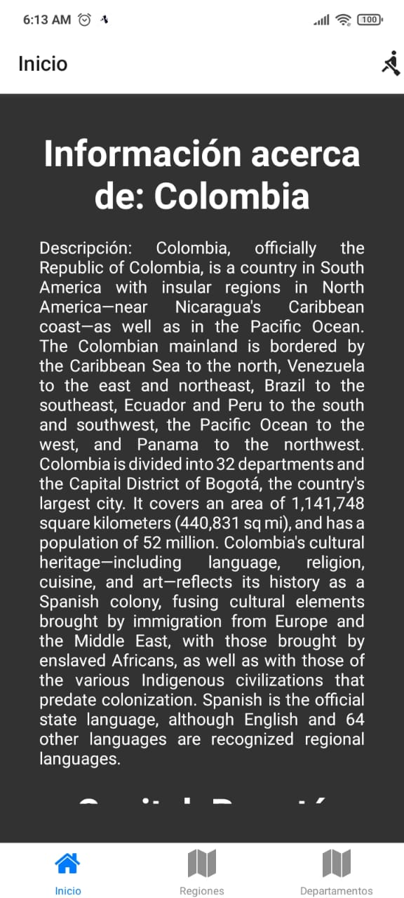
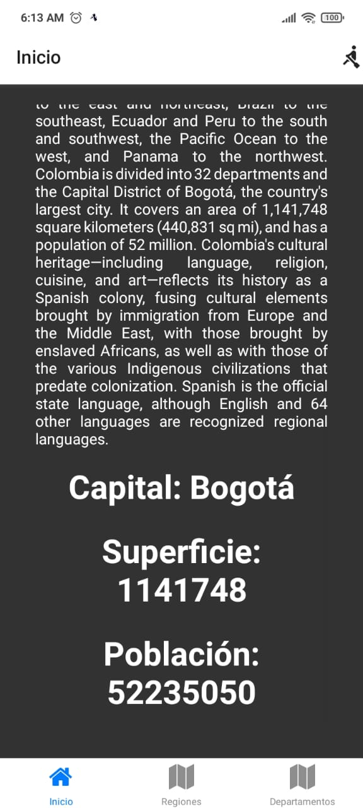
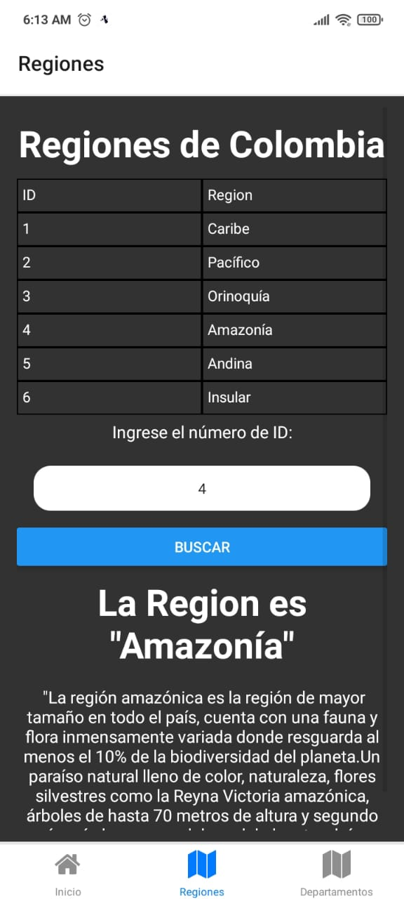
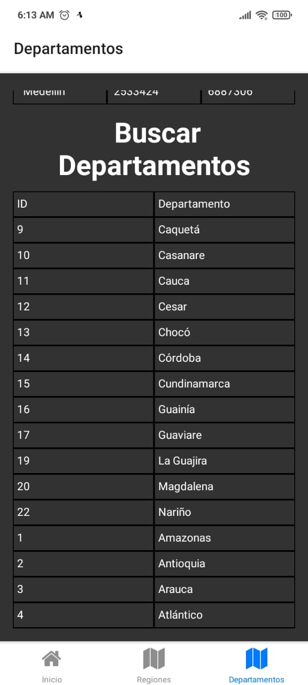
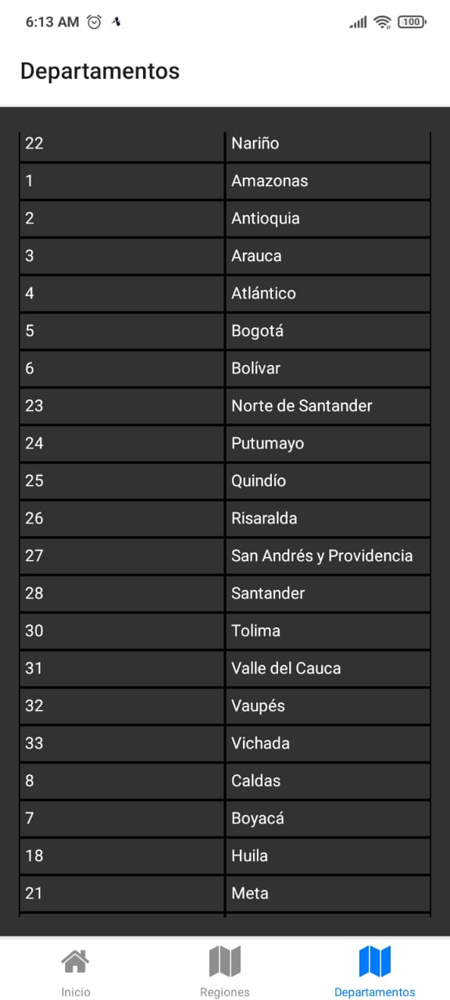

# Installation Guide for API-colombia
==================================================

This is a guide to help you install Project-Gers-yake, a React-Native project built with Expo.

## Prerequisites
-------------

Before installing Project-Gers-yake, make sure you have the following software installed on your machine:

-   Node.js (version 14 or higher)
-   npm (version 6 or higher)
-   Expo CLI (version 4 or higher)
-   Xcode (if you're using a Mac and plan to develop for iOS)

## Installation Steps
------------------

1.  Clone the project from the Github repository:


`git clone https://github.com/gerson434/API-colombia.git`

1.  Navigate to the project directory:


`cd API-colombia`

1.  Install the project dependencies:


`npm install`

1.  Start the Expo server:


`npx expo start`

1.  If you're using a Mac and plan to develop for iOS, open another terminal window and run the following command to start the iOS simulator:


`expo ios`

If you're developing for Android, you'll need to have an Android emulator or device connected to your machine, and you can start the app using the following command:


`expo android`

1.  You should now see the Project-Gers-yake app running in the simulator or on your device.

## Conclusion
----------

Congratulations, you have successfully installed Project-Gers-yake on your machine using Expo! You can now start developing new features and making improvements to the app.

# React Native Colombia Info App
==============================

This React Native project retrieves general information about Colombia using an API. The information includes the country's surface area, capital, regions, and departments. The app displays the retrieved information in a user-friendly manner, making it easy for users to access and understand.

The app uses React Native, a popular framework for building mobile applications, and fetches data from the API using HTTP requests. The app also makes use of various components and modules to display the information in an organized and visually appealing way.

The project is designed to provide a convenient way for users to learn about Colombia's geography and basic information. It's a great resource for anyone interested in visiting or learning more about this beautiful country.

## photographic evidence 
==================================

### Home



### Regions



### Departaments




# Code Explanation
=================================

# Conection API

## Services
============

This file exports several functions that make API requests to get information about Colombia.

Installation
------------

This file uses the axios library to make HTTP requests. Make sure to install it by running:


`npm install axios`

## Usage
-----

Import the functions you need from this file into your React Native component:


`import { getColombiaInfo, getRegionesColombia, getRegionColombia, getDepartamentosColombia, getDepartamentoColombia } from '../api/services';`

Then use the functions to make API requests:


`const data = await getColombiaInfo();
const regionesColombia = await getRegionesColombia();
const departamento = await getDepartamentoColombia(id);`

## Functions
---------

### getColombiaInfo()

Makes a GET request to the Colombia country endpoint.

Returns an object with information about Colombia.

### getRegionesColombia()

Makes a GET request to the regions endpoint.

Returns an array of objects with information about the regions of Colombia.

### getRegionColombia(id)

Makes a GET request to the regions endpoint with the specified ID parameter.

Returns an object with information about the region of Colombia with the specified ID.

### getDepartamentosColombia()

Makes a GET request to the departments endpoint.

Returns an array of objects with information about the departments of Colombia.

### getDepartamentoColombia(id)

Makes a GET request to the departments endpoint with the specified ID parameter.

Returns an object with information about the department of Colombia with the specified ID.


# Components


## BarraNav
========

`BarraNav` is a React component that defines a bottom tab navigator using `createBottomTabNavigator` from `@react-navigation/bottom-tabs` package. It includes three screens: `MainPage`, `Regiones`, and `Departamentos`. Each screen is associated with a tab icon.

### Dependencies
------------

This component requires the following dependencies:

-   `react-native-elements`
-   `@react-navigation/native`
-   `@react-navigation/bottom-tabs`

### Usage
-----
```React 
import { Icon } from "react-native-elements"
import MainPage from "./MainPage"
import Regiones from "./Regiones"
import { createBottomTabNavigator } from "@react-navigation/bottom-tabs"
import RegionesForm from "./Departamentos"
import Departamentos from "./Departamentos"

// create a bottom tab navigator using createBottomTabNavigator()
const Tab = createBottomTabNavigator()

// define a function that returns the bottom tab navigator
function BarraNav() {
    return (
        <Tab.Navigator>
            <Tab.Screen 
                name= 'Inicio'
                component={MainPage}
                options = {{
                    tabBarIcon:({color, size}) =>(
                        <Icon name="home"
                            type="font-awesome"
                            color={color}
                            size={size}
                        />
                    )
                }}
            />
            <Tab.Screen 
                name= 'Regiones'
                component={Regiones}
                options = {{
                    tabBarIcon:({color, size}) =>(
                        <Icon name="map"
                            type="font-awesome"
                            color={color}
                            size={size}
                        />
                    )
                }}
            />
            <Tab.Screen 
                name= 'Departamentos'
                component={Departamentos}
                options = {{
                    tabBarIcon:({color, size}) =>(
                        <Icon name="map"
                            type="font-awesome"
                            color={color}
                            size={size}
                        />
                    )
                }}
            />
        </Tab.Navigator>
    )
}

// export the function as the default export of the module
export default BarraNav;

```
### Props
-----

`BarraNav` does not accept any props.
## Departaments


This React Native project retrieves general information about Colombia using an API. The information includes the country's surface area, capital, regions, and departments. The app displays the retrieved information in a user-friendly manner, making it easy for users to access and understand.

### Technologies Used
-----------------

This project uses the following technologies:

-   React Native
-   JavaScript
-   API requests using HTTP

### How to Use
----------

To use this app, follow these steps:

1.  Clone the repository to your local machine.
2.  Install the necessary dependencies using `npm install`.
3.  Start the app using `npm start`.

### Features
--------

This app allows users to:

-   Search for a department in Colombia by ID.
-   View information about the searched department, including its name, description, capital city, and population.
-   View a list of all departments in Colombia.

### Example Code
------------

Here is an example of the code used to retrieve information about a department by ID:

```React-Navite
import { useEffect } from "react";
import { useState } from "react";
import {getDepartamentoColombia, getDepartamentosColombia} from '../api/services';
import { View, Text, StyleSheet, TextInput,Button, ScrollView } from "react-native";


const Departamentos = ()=>{
    const [id, setId] = useState('');
    const [resultado, setResultado] = useState(null);
  
    const buscarDepartamento = async () => {
      try {
        const data = await getDepartamentoColombia(id);
        setResultado(data);
      } catch (error) {
        console.error(error);
      }
    };
  //aqui acaba el buscador
    const [departamentosColombia, setDepartamentosColombia] = useState([]);
    useEffect(() =>{
        async function fetchData(){
            const departamentosColombia = await getDepartamentosColombia();
            setDepartamentosColombia(departamentosColombia);
        }
        fetchData();
    },[]);
    return (
        <View style={styles.container}>
            <ScrollView>
            <Text style={styles.text}>Ingrese el número de ID:</Text>
        <TextInput style={styles.input} value={id} onChangeText={setId} />
        <Button style={styles.butom} title="Buscar" onPress={buscarDepartamento} />
        
      
        {resultado && ([
          <Text style={styles.title}>El Departamento es {JSON.stringify(resultado.name)}</Text>,
          <Text style={styles.text}> {JSON.stringify(resultado.description)}</Text>,
          <View style={styles.row}>
                    <Text style={styles.cell}>Capital</Text>
                    <Text style={styles.cell}>Poblacion Capital</Text>
                    <Text style={styles.cell}>Poblacion</Text>
                </View>,
             <View style={styles.row}>
          <Text style={styles.cell}> {JSON.stringify(resultado.cityCapital.name)}</Text>
          <Text style={styles.cell}> {JSON.stringify(resultado.cityCapital.population)}</Text>
          <Text style={styles.cell}> {JSON.stringify(resultado.population)}</Text>
          </View>
        ]
        )}
          
       <Text style={styles.title}> Buscar Departamentos</Text>
      <View style={styles.row}>
                    <Text style={styles.cell}>ID</Text>
                    <Text style={styles.cell}>Departamento</Text>
                </View>
      
           
            {departamentosColombia.map(region => (
                     
               <View style={styles.row}>
                        <Text key={region.id} style={styles.cell}>{region.id}</Text>
                        <Text key={region.id} style={styles.cell}>{region.name}</Text>
                    </View>
            ))}

</ScrollView>
        </View>
    );
}
const styles = StyleSheet.create({
    container: {
        flex: 1,
        alignItems: 'center',
        justifyContent: 'center',
        backgroundColor:'#323232',
        marginVertical: 2,
        borderColor: 'black',
        paddingTop:20,
        padding:15,
      },
      title: {
        fontSize: 35,
        fontWeight: 'bold',
        marginVertical: 10,
        textAlign:'center',
        color:'white'
  
      },
      text: {
        fontSize: 16,
        marginVertical: 5,
        color:'white',
        justifyContent:'center',
        textAlign:'justify',
      },
      input: {
        backgroundColor:'#fff',
        width:300,
        margin:15,
        height:40,
        borderRadius:15,
        textAlign:'center'

      },
      butom: {
        maxWidth:50,
        
      },
      row: {
        flexDirection: 'row',
        color:'white',
        fontWeight: 900,
        fontSize:30,
       
         },
      cell: {
        flex: 1,
        padding: 5,
        borderWidth: 1,
        borderColor: 'black',
        color:'white',

      },
    });
export default Departamentos;
```
### Conclusion
----------

This project is a convenient way for users to learn about Colombia's geography and basic information. It's a great resource for anyone interested in visiting or learning more about this beautiful country.


## MainPage
Here is an example of how the documentation for the code you provided would look in Markdown format:

### MainPage Component
------------------

The `MainPage` component is a React functional component that displays information about Colombia. It includes the following functionality:

-   Calls the `getColombiaInfo` function to fetch information about Colombia
-   Displays the fetched information in the component
-   Includes a navigation button in the header

### Props

-   `navigation`: A navigation prop provided by React Navigation.

### Code Example
```React-Native
import React, { useEffect, useState } from "react";
import { View, Text, StyleSheet, ScrollView } from "react-native";
import { Icon } from "react-native-elements";
import { getColombiaInfo } from "../api/services";

const MainPage = ({navigation}) => {
  const [colombiaInfo, setColombiaInfo] = useState({});

  useEffect(() => {
    async function fetchData() {
      const colombiaData = await getColombiaInfo();
      setColombiaInfo(colombiaData);
    }
    fetchData();
    navigation.setOptions({
      headerRight: () => {
        return (
          <Icon name='rowing' onPress={() => navigation.navigate('')} />
        );
      },
    });
  });

  return (
    <View style={styles.container}>
      <ScrollView>
        <Text style={styles.title}>Información acerca de: {colombiaInfo.name}</Text>
        <Text style={styles.text}>Descripción: {colombiaInfo.description}</Text>       
        <Text style={styles.title}>Capital: {colombiaInfo.stateCapital}</Text>
        <Text style={styles.title}>Superficie: {colombiaInfo.surface}</Text>
        <Text style={styles.title}>Población: {colombiaInfo.population}</Text>
      </ScrollView>
    </View>
  );
};

const styles = StyleSheet.create({
  container: {
    flex: 1,
    alignItems: "center",
    justifyContent: "center",
    backgroundColor: "#323232",
    paddingTop: 20,
    padding: 35,
  },
  title: {
    fontSize: 35,
    fontWeight: "bold",
    marginVertical: 10,
    textAlign: "center",
    color: "white",
  },
  text: {
    fontSize: 16,
    marginVertical: 5,
    color: "white",
    textAlign: "justify",
  },
});

export default MainPage;

```


### Regions


This is a React component that displays a list of the regions of Colombia and allows the user to search for a specific region by ID.

### Importing
---------

To use this component, import it as follows:


`import Regiones from './path/to/Regiones';`

### Usage
-----

To use this component, simply include it in the render method of your parent component, like so:


`<Regiones />`

### Props
-----

This component has no props.

### State
-----

This component has two pieces of state:

### `id`

The ID of the region to search for.

### `resultado`

The result of the search, if there is one.

### Methods
-------

This component has one method:

### `buscarRegion`

This method is called when the user clicks the "Buscar" button. It retrieves the region with the ID specified in the `id` state variable, and sets the `resultado` state variable to the retrieved data.

### Styling
-------

This component uses a StyleSheet object to define its styles. The following styles are available:

### `container`

The style for the component's container.

### `title`

The style for the component's title.

### `text`

The style for the component's text.

### `input`

The style for the component's input.

### `butom`

The style for the component's button.

### `row`

The style for the component's table rows.

### `cell`

The style for the component's table cells.

### Example
-------
```React-Native
import { useEffect } from "react";
import { useState } from "react";
import {getRegionesColombia, getRegionColombia} from '../api/services';
import { View, Text, StyleSheet, TextInput,Button, ScrollView } from "react-native";


const Regiones = ()=>{
    const [id, setId] = useState('');
    const [resultado, setResultado] = useState(null);
  
    const buscarRegion = async () => {
      try {
        const data = await getRegionColombia(id);
        setResultado(data);
      } catch (error) {
        console.error(error);
      }
    };
  //aqui acaba el buscador
    const [regionesColombia, setRegionesColombia] = useState([]);
    useEffect(() =>{
        async function fetchData(){
            const regionesColombia = await getRegionesColombia();
            setRegionesColombia(regionesColombia);
        }
        fetchData();
    },[]);
    return (
        <View style={styles.container}>
            <ScrollView>
       <Text style={styles.title}>Regiones de Colombia</Text>
      <View style={styles.row}>
                    <Text style={styles.cell}>ID</Text>
                    <Text style={styles.cell}>Region</Text>
                </View>
      
           
            {regionesColombia.map(region => (
                     
               <View style={styles.row}>
                        <Text key={region.id} style={styles.cell}>{region.id}</Text>
                        <Text key={region.id} style={styles.cell}>{region.name}</Text>
                    </View>
            ))}
 <Text style={styles.text}>Ingrese el número de ID:</Text>
        <TextInput style={styles.input} value={id} onChangeText={setId} />
        <Button style={styles.butom} title="Buscar" onPress={buscarRegion} />
        {resultado && (
          <><Text style={styles.title}>La Region es {JSON.stringify(resultado.name)}</Text><Text style={styles.text}> {JSON.stringify(resultado.description)}</Text></>
        )}
          
</ScrollView>
        </View>
    );
}
const styles = StyleSheet.create({
    container: {
        flex: 1,
        alignItems: 'center',
        justifyContent: 'center',
        backgroundColor:'#323232',
        marginVertical: 2,
        padding:10,
        borderColor: 'black',
      },
      title: {
        fontSize: 35,
        fontWeight: 'bold',
        marginVertical: 10,
        textAlign:'center',
        color:'white'
  
      },
      text: {
        fontSize: 16,
        marginVertical: 5,
        color:'white',
        justifyContent:'center',
        textAlign:'center',
      },
      input: {
        backgroundColor:'#fff',
        width:300,
        margin:15,
        height:40,
        borderRadius:15,
        textAlign:'center'

      },
      butom: {
        maxWidth:50,
        
      },
      row: {
        flexDirection: 'row',
        color:'white',
        fontWeight: 900,
        fontSize:30,
       
         },
      cell: {
        flex: 1,
        padding: 5,
        borderWidth: 1,
        borderColor: 'black',
        color:'white',

      },
    });
export default Regiones;
```
# Index
## App 
### Libraries Used
--------------

-   `@react-navigation/native`: Library for managing navigation in React Native applications.
-   `@react-navigation/stack`: Library for managing navigation using stack in React Native applications.
-   `react-native`: Library for developing mobile applications with React.

### Components
----------

-   `NavigationContainer`: React Navigation component that provides a navigation context to the application.
-   `createStackNavigator`: Function that returns a `Stack` component with which application routes can be defined.
-   `BarraNav`: Custom component that is responsible for rendering the navigation bar of the application.

### Functions
---------

-   `App`: Main function of the application that returns the `NavigationContainer` component that contains the `BarraNav` component.

### Styles
------

-   `styles`: React Native style object that defines the style of the main container of the application (`container`), with a white background, center alignment and justification."# Project-Api-Colombia" 
